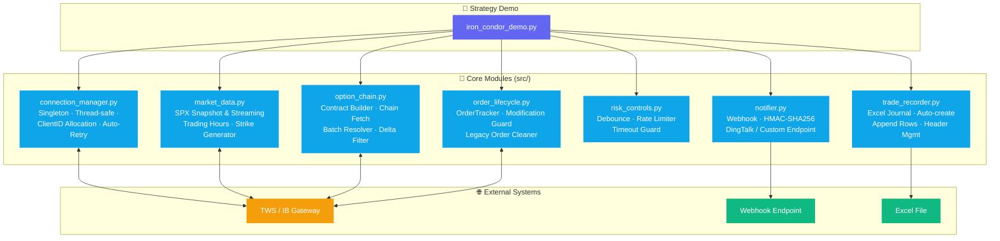

<div align="center">

# 🥘 IBKR Options Cookbook

**IBKR Python 期权自动化交易：架构设计模式与实战指南**

[](https://github.com/donglinfei-debug/ibkr-options-cookbook/stargazers)
[](https://github.com/donglinfei-debug/ibkr-options-cookbook/issues)
[](https://github.com/donglinfei-debug/ibkr-options-cookbook/forks)
[](LICENSE)
[](https://www.python.org/)
[](https://www.interactivebrokers.com/)

🌏 **Language / 语言**：[🇨🇳 中文](README.zh.md) | [🇬🇧 English](README.md)

</div>

---

An open-source knowledge base for **Interactive Brokers (IBKR) API** options traders. This is **not** a "copy-paste trading bot" — it's a **cookbook of architecture patterns**, with clean, modular code as the medium.


## 📌 Why This?

If you're building automated options trading systems on the IB API, you've faced these questions:

- **How to manage multiple modules sharing a single TWS connection** without ClientID conflicts?
- **How to batch-fetch option chain data** efficiently without hitting API rate limits?
- **How to automatically adjust limit order prices** to improve fill rates in fast-moving markets?
- **How to prevent risk controls from being overwhelmed** by false signals in volatile conditions?

**ibkr-options-cookbook** answers these questions with clean, modular reference code — using the SPX Iron Condor strategy as a running case study. It's not a ready-to-run bot; it's a collection of battle-tested architecture patterns.

## 🏗️ Architecture Overview



## 📖 What Is This?

If you're building automated options trading systems on the IB API, you've faced these questions:

- How to manage multiple modules sharing a single TWS connection **without ClientID conflicts**?
- How to **batch-fetch option chain data** efficiently?
- How to **automatically adjust limit order prices** to improve fill rates?
- How to **prevent risk controls from being overwhelmed** by market noise in volatile conditions?

**ibkr-options-cookbook** answers these questions using the **SPX Iron Condor** strategy as a running case study. Each chapter covers one design topic, accompanied by clean, independently usable reference code.

## 📦 System Requirements

| Requirement | Minimum | Recommended |
|:------------|:--------|:------------|
| **Python** | 3.8 | 3.11+ |
| **TWS / IB Gateway** | Build 978+ | Latest stable |
| **RAM** | 256 MB | 512 MB+ |
| **Market Data Subscription** | Snapshot only | Live streaming |
| **OS** | Windows / macOS / Linux | — |

## 📂 Structure

```
ibkr-options-cookbook/
├── docs/
│   ├── zh/          ← Chinese docs (9 chapters)
│   └── en/          ← English docs (9 chapters)
├── src/
│   ├── connection_manager.py   ← Connection: Singleton, ClientID, auto-retry
│   ├── market_data.py          ← Data: SPX snapshot/streaming, strike gen
│   ├── option_chain.py         ← Chain: contract builder, batch fetch, delta filter
│   ├── order_lifecycle.py      ← Orders: tracker, modification guard, cleanup
│   ├── risk_controls.py        ← Risk: Debounce, RateLimiter, TimeoutGuard
│   ├── notifier.py             ← Alerts: DingTalk webhook, HMAC-SHA256
│   └── trade_recorder.py       ← Journal: Excel trade recording
├── examples/
│   └── iron_condor_demo.py     ← Demo: Iron Condor walkthrough
├── README.md
├── README.zh.md
├── LICENSE                     ← MIT
└── .env.example                ← Template for config
```

## 📚 Chapters

| # | English | Chinese |
|:-|:--------|:--------|
| 1 | [Architecture Overview](docs/en/01-architecture.md) | [系统架构全景](docs/zh/01-architecture.md) |
| 2 | [Connection Pattern](docs/en/02-connection-pattern.md) | [连接管理设计模式](docs/zh/02-connection-pattern.md) |
| 3 | [Market Data](docs/en/03-market-data.md) | [市场数据获取](docs/zh/03-market-data.md) |
| 4 | [Contracts & Chain](docs/en/04-contracts-and-chain.md) | [合约管理与期权链](docs/zh/04-contracts-and-chain.md) |
| 5 | [Order Lifecycle](docs/en/05-order-lifecycle.md) | [订单执行与生命周期](docs/zh/05-order-lifecycle.md) |
| 6 | [Price Adjustment](docs/en/06-price-adjustment.md) | [价格退让机制](docs/zh/06-price-adjustment.md) |
| 7 | [Risk Control](docs/en/07-risk-control.md) | [风控机制](docs/zh/07-risk-control.md) |
| 8 | [Notification & Recording](docs/en/08-notification-and-recording.md) | [交易通知与记录](docs/zh/08-notification-and-recording.md) |
| 9 | [Case Study: Iron Condor](docs/en/09-iron-condor-case-study.md) | [铁鹰策略案例全流程](docs/zh/09-iron-condor-case-study.md) |

## 🚀 Quick Start

```bash
# 1. Clone
git clone https://github.com/donglinfei-debug/ibkr-options-cookbook.git
cd ibkr-options-cookbook

# 2. (Recommended) Create virtual environment
python -m venv venv
source venv/bin/activate  # Windows: venv\Scripts\activate

# 3. Install dependencies
pip install ibapi pytz pandas openpyxl requests

# 4. Start reading
# Start with docs/en/01-architecture.md or docs/zh/01-architecture.md
```

> **Note**: `ibapi` is Interactive Brokers' official Python API. It is **not** available on PyPI — download it from your TWS/IB Gateway installation directory or the [IB GitHub](https://github.com/InteractiveBrokers/tws-api).

## 💻 Tech Stack

| Component | Technology |
|:----------|:-----------|
| **Broker API** | Interactive Brokers (`ibapi`) |
| **Data** | `pandas`, `pytz` |
| **Notifications** | `requests` (DingTalk webhook, HMAC-SHA256) |
| **Journaling** | `openpyxl` (Excel) |
| **Python** | 3.8+ |

## ⚠️ Important Notes

1. **This is NOT a runnable trading bot.** It is a knowledge base covering design patterns, architecture decisions, and curated code snippets — not a complete trading strategy implementation.
2. **Trading involves risk.** All code is for educational reference only. Test thoroughly before live use. Trade at your own risk.
3. **Core strategy parameters are not published here.** The Iron Condor's specific parameters (Delta thresholds, credit ranges, special adjustment prices, etc.) are the author's proprietary trading experience and are outside the scope of this repository.


## ❓ FAQ

**Is this a ready-to-run trading bot?**
No. This is a knowledge base of architecture patterns and reference code, not a complete trading strategy. You need to supply your own strategy logic and risk parameters.

**Do I need a live TWS connection to use this?**
Yes. The code modules connect to TWS or IB Gateway. A paper trading account with market data subscriptions is sufficient for development and testing.

**What is the Iron Condor strategy used in the examples?**
The Iron Condor is a non-directional options strategy that sells an out-of-the-money put spread and call spread simultaneously. It profits when the underlying stays within a defined range.

**Can I use these modules for other strategies besides Iron Condor?**
Absolutely. The modules are strategy-agnostic — connection management, data fetching, order lifecycle, and risk controls work with any options or equities strategy.

## 📄 License

[MIT](LICENSE)

## 🌟 Star History

[](https://star-history.com/#donglinfei-debug/ibkr-options-cookbook&Date)

If you find this useful, please consider starring ⭐ the repository — it motivates continued updates.


## 👤 About the Author

**Ryan Dong** — AI Product Manager & Full-Stack Developer

I bridge the gap between AI capabilities and production-ready software. My work spans the full stack: from designing AI-powered product features and integrating LLM APIs, to building modular backend services and shipping clean, documented code.

| Role | Focus |
|:-----|:------|
| 🧠 **AI Product Manager** | Product strategy, AI feature design, prompt engineering, model selection |
| 💻 **Full-Stack Developer** | Python, FastAPI, Google Apps Script, automation pipelines, API integration |

This repository is part of a personal toolbox — a growing collection of practical, reusable modules that solve real automation problems. Each project is designed to be independently useful and easily integrated into larger systems.

📬 **donglinfei@gmail.com** — open to business discussions, collaborations, and recruiting inquiries.

## 📬 Contact

- **Author**: Ryan Dong
- **Email**: donglinfei@gmail.com (business / recruiting inquiries)
