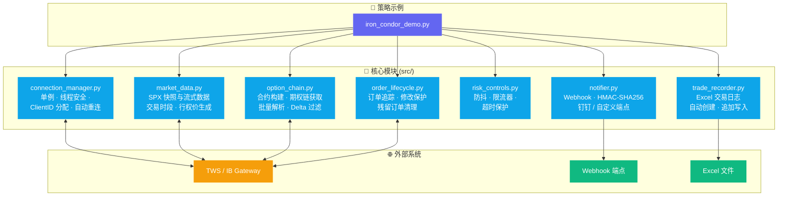

<div align="center">

# 🥘 IBKR Options Cookbook

**IBKR Python 期权自动化交易：架构设计模式与实战指南**

[](https://github.com/donglinfei-debug/ibkr-options-cookbook/stargazers)
[](https://github.com/donglinfei-debug/ibkr-options-cookbook/issues)
[](https://github.com/donglinfei-debug/ibkr-options-cookbook/forks)
[](LICENSE)
[](https://www.python.org/)
[](https://www.interactivebrokers.com/)

🌏 **语言 / Language**：[🇨🇳 中文](README.zh.md) | [🇬🇧 English](README.md)

</div>

---

Interactive Brokers (IBKR) API 期权自动化交易的开源知识库。这不是一个"复制粘贴就能跑的交易机器人"——而是一本**架构设计模式的食谱**，以干净、模块化的代码作为载体。

## 🏗️ 架构总览



## 📖 这是什么？

如果你在用 IB API 构建自动化期权交易系统，你可能遇到过这些问题：

- 多个模块共享一个 TWS 连接时，如何避免 **ClientID 冲突**？
- 如何高效地**批量获取期权链数据**？
- 如何**自动调整限价单价格**以提高成交率？
- 如何在剧烈波动行情中**防止风控被假信号击穿**？

**ibkr-options-cookbook** 以 **SPX 铁鹰策略（Iron Condor）** 作为贯穿案例来回答这些问题。每章覆盖一个设计主题，并附有干净、可独立使用的参考代码。

## 📦 系统要求

| 要求 | 最低 | 推荐 |
|:-----|:-----|:-----|
| **Python** | 3.8 | 3.11+ |
| **TWS / IB Gateway** | Build 978+ | 最新稳定版 |
| **内存** | 256 MB | 512 MB+ |
| **行情数据订阅** | 仅快照 | 实时流式数据 |
| **操作系统** | Windows / macOS / Linux | — |

## 📂 目录结构

```
ibkr-options-cookbook/
├── docs/
│   ├── zh/          ← 中文文档（共 9 章）
│   └── en/          ← 英文文档（共 9 章）
├── src/
│   ├── connection_manager.py   ← 连接：单例、ClientID、自动重连
│   ├── market_data.py          ← 数据：SPX 快照/流式、行权价生成
│   ├── option_chain.py         ← 链：合约构建、批量获取、Delta 过滤
│   ├── order_lifecycle.py      ← 订单：追踪、修改保护、残留清理
│   ├── risk_controls.py        ← 风控：防抖、限流器、超时保护
│   ├── notifier.py             ← 通知：钉钉 Webhook、HMAC-SHA256
│   └── trade_recorder.py       ← 日志：Excel 交易记录
├── examples/
│   └── iron_condor_demo.py     ← 示例：铁鹰策略流程演示
├── README.md
├── README.zh.md
├── LICENSE                     ← MIT
└── .env.example                ← 配置模板
```

## 📚 章节

| # | 中文 | English |
|:-|:-----|:--------|
| 1 | [系统架构全景](docs/zh/01-architecture.md) | [Architecture Overview](docs/en/01-architecture.md) |
| 2 | [连接管理设计模式](docs/zh/02-connection-pattern.md) | [Connection Pattern](docs/en/02-connection-pattern.md) |
| 3 | [市场数据获取](docs/zh/03-market-data.md) | [Market Data](docs/en/03-market-data.md) |
| 4 | [合约管理与期权链](docs/zh/04-contracts-and-chain.md) | [Contracts & Chain](docs/en/04-contracts-and-chain.md) |
| 5 | [订单执行与生命周期](docs/zh/05-order-lifecycle.md) | [Order Lifecycle](docs/en/05-order-lifecycle.md) |
| 6 | [价格退让机制](docs/zh/06-price-adjustment.md) | [Price Adjustment](docs/en/06-price-adjustment.md) |
| 7 | [风控机制](docs/zh/07-risk-control.md) | [Risk Control](docs/en/07-risk-control.md) |
| 8 | [交易通知与记录](docs/zh/08-notification-and-recording.md) | [Notification & Recording](docs/en/08-notification-and-recording.md) |
| 9 | [铁鹰策略案例全流程](docs/zh/09-iron-condor-case-study.md) | [Case Study: Iron Condor](docs/en/09-iron-condor-case-study.md) |

## 🚀 快速开始

```bash
# 1. 克隆仓库
git clone https://github.com/donglinfei-debug/ibkr-options-cookbook.git
cd ibkr-options-cookbook

# 2. （推荐）创建虚拟环境
python -m venv venv
source venv/bin/activate  # Windows: venv\Scripts\activate

# 3. 安装依赖
pip install ibapi pytz pandas openpyxl requests

# 4. 开始阅读
# 从 docs/zh/01-architecture.md 开始
```

> **注意**：`ibapi` 是盈透证券官方 Python API，**不在 PyPI 上**。请从 TWS/IB Gateway 安装目录或 [IB GitHub](https://github.com/InteractiveBrokers/tws-api) 获取。

## 💻 技术栈

| 组件 | 技术 |
|:-----|:-----|
| **券商 API** | Interactive Brokers (`ibapi`) |
| **数据处理** | `pandas`、`pytz` |
| **消息通知** | `requests`（钉钉 Webhook、HMAC-SHA256） |
| **交易记录** | `openpyxl`（Excel） |
| **Python** | 3.8+ |

## ⚠️ 重要说明

1. **这不是一个可直接运行的交易机器人。** 它是一本架构设计模式的知识库，包含设计决策和精选代码片段——不是完整的交易策略实现。
2. **交易有风险。** 所有代码仅用于学习参考。实盘前务必充分测试。交易风险自负。
3. **核心策略参数未公开。** 铁鹰策略的具体参数（Delta 阈值、权利金范围、特殊调整价格等）是作者的专有交易经验，不在本仓库范围内。

## 📄 许可证

[MIT](LICENSE)

## 🌟 Star 历史

[](https://star-history.com/#donglinfei-debug/ibkr-options-cookbook&Date)

如果你觉得这个项目有用，欢迎点 ⭐ Star——这是对持续更新的最大鼓励。

## 📬 联系

- **作者**: Ryan Dong
- **邮箱**: donglinfei@gmail.com（商务 / 招聘联系）
